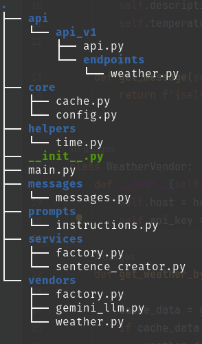
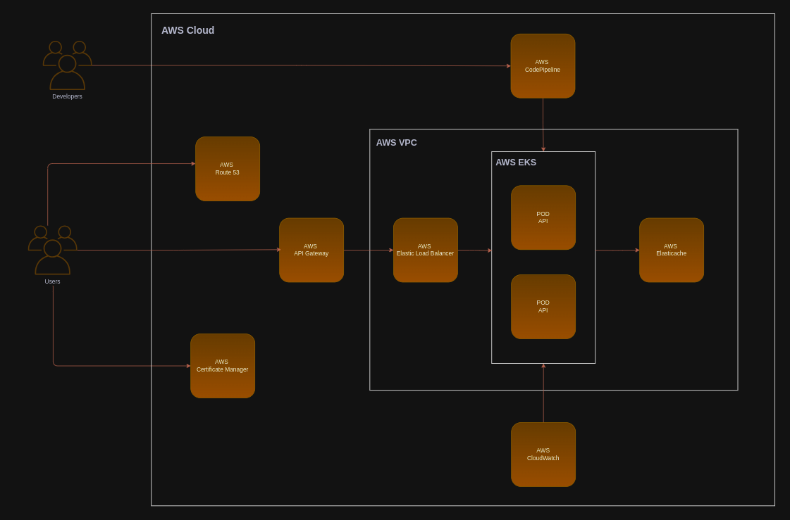

# Architecture

This document provides an overview of application and your components. By the end of this guide, you should have a good 
understanding of the main features and functionalities provided by the system.

## Table of Contents

- [Overview](#overview)
- [Integration with OpenWeatherMap API](#integration-with-openweathermap-api)
- [Integration with Google Gemini](#integration-with-openweathermap-api)
- [Development environment and infrastructure](#development-environment-infrastructure)
- [Diagram](#diagram)

## Overview

The application is based on the [FastAPI](https://fastapi.tiangolo.com/) framework, which is widely used in the market 
and has a large open-source community, used in more than 400 thousand Github repositories. In order to meet the proposed 
requirements (generating content with weather information for a city), the OpenWeatherMap API was chosen to provide 
weather information and the content generation process was delegated to Google Gemini. Based on the chosen framework, 
the file structure aims to make maintenance and replacement of components (external suppliers) simple.

## Integration with OpenWeatherMap API

The OpenWeatherMap API was defined to retrieve the weather conditions of a city. In order to optimize the use of the API, 
each query for a city is cached for 60 seconds. 

The code for this integration is located in the app.vendors namespace and is defined with the ResponseWeather class.

## Integration with Google Gemini

For content generation, Google Gemini was selected for this purpose, because in addition to having a good testing 
environment to execute and test prompts, it maintains constant evolution of its language models, with enough free access 
layers to execute tests on a large scale.  

The code for this integration is in the app.vendors namespace and is defined using the GeminiLLM class.

## Development environment and infrastructure

The application is fully containerized using Docker, and the development environment follows this process. The setup 
includes a carefully crafted Dockerfile that defines the steps to build a lightweight, optimized application image, 
covering dependencies, environment configurations, and build instructions.

To run the application, two containers were defined: one with Python 3.12 and its dependencies installed and another 
for Redis.

## Diagram

The following diagram defines an initial proposal for running the application on AWS, with the requirements for 
maintaining the application.

    AWS Cloud
        - AWS Router 53
        - AWS Certificate Manager
        - AWS API Gateway 
        - AWS CodePipeline
        - AWS CloudWatch
        AWS VPC
            - AWS Elastic Load Balancer
            AWS EKS
                - POD API 
                - POD API 
                - ...
            - AWS Elasticache 

